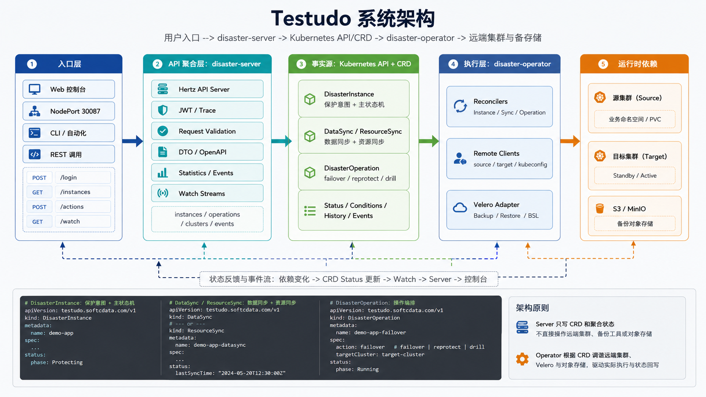

# Testudo

[English](README.md) | [简体中文](README.zh-CN.md)

Testudo（中文名：玄龟阵）是一个面向 Kubernetes 的应用级容灾编排系统。它通过 Kubernetes CRD 保护跨集群应用，同步应用资源和 PVC 数据，准备目标集群 standby 环境，并编排故障切换、反向保护、容灾组和容灾演练。

它解决的核心问题是：平台团队需要一种可重复、可观察、可审计的方式保护 Kubernetes 应用，在目标集群保持可恢复状态，在故障时完成切换，并能定期验证恢复链路，而不是为每个流程手工拼装 Velero `Backup`、`Restore` 和 `Schedule` 资源。

快速入口：

- 文档站：[https://testudo.softcdata.com](https://testudo.softcdata.com)
- 安装指南：[安装](https://testudo.softcdata.com/docs/getting-started/install)
- 快速开始：[创建第一个容灾实例](https://testudo.softcdata.com/docs/getting-started/create-first-instance)
- 第一次故障切换：[第一次故障切换](https://testudo.softcdata.com/docs/getting-started/first-failover)
- 系统架构：[系统架构](https://testudo.softcdata.com/docs/overview/architecture)
- 兼容性：[兼容性矩阵](https://testudo.softcdata.com/docs/reference/compatibility-matrix)
- 安全：[安全概览](https://testudo.softcdata.com/docs/operations/security-overview)

## 项目组成

这个 README 面向 Testudo 运行时相关项目共用。一套完整源码通常包含以下仓库：

| 项目 | 职责 |
| --- | --- |
| [`testudo-operator`](https://github.com/softcdata/testudo-operator) | Kubernetes CRD、admission webhook、控制器、流程状态机，以及对 Kubernetes 和 Velero 资源的实际调谐。 |
| [`testudo-server`](https://github.com/softcdata/testudo-server) | REST API、Watch API、认证、Swagger/OpenAPI、统计接口，以及面向控制台的聚合接口。 |
| [`testudo-chart`](https://github.com/Softcdata/testudo-chart) | Helm Chart，用于把 `testudo-operator`、`testudo-server` 和 Web 控制台打包成一个 `disaster-system` 安装包。 |
| [`testudo-web`](https://github.com/Softcdata/testudo-web) | Vue/Vite Web 控制台，用于集群注册、存储配置、容灾实例、容灾组、演练和操作流程。 |

GitHub 是本项目事实源。如提供 Gitee 仓库，Gitee 用于国内访问加速和同步镜像。

## 快速开始

前置条件：

- 一个管理 Kubernetes 集群。
- 至少两个业务集群，分别承担源集群和目标集群角色。
- 源集群和目标集群都能访问 S3 兼容对象存储。
- 业务集群可以拉取 Velero 镜像，或 Velero 镜像已经提前同步到内网镜像仓库。Testudo 可以在添加集群时安装或对齐 Velero。
- 已安装 `kubectl` 和 Helm v3。

通过 `testudo-chart` Helm Chart 安装控制面：

```bash
helm repo add testudo https://softcdata.github.io/testudo-chart
helm repo update

helm upgrade --install testudo testudo/testudo-chart \
  -n disaster-system \
  --create-namespace
```

打开控制台：

```text
http://<NodeIP>:30087
```

然后按以下路径完成第一次容灾体验：

1. [注册集群](https://testudo.softcdata.com/docs/getting-started/register-clusters)
2. [配置存储](https://testudo.softcdata.com/docs/getting-started/configure-storage)
3. [创建第一个容灾实例](https://testudo.softcdata.com/docs/getting-started/create-first-instance)
4. [第一次故障切换](https://testudo.softcdata.com/docs/getting-started/first-failover)

部署到真实环境前，请先阅读完整的 [安装文档](https://testudo.softcdata.com/docs/getting-started/install) 和 [兼容性矩阵](https://testudo.softcdata.com/docs/reference/compatibility-matrix)。生产环境还需要确认镜像拉取 Secret、webhook 证书、存储仓库、License 安装方式、集群权限和 [安全概览](https://testudo.softcdata.com/docs/operations/security-overview)。

## 系统架构



Testudo 整体分为五层：

- **用户入口层**：Web 控制台、CLI、自动化平台或直接 API 调用。
- **API 聚合层**：`disaster-server` 校验请求、写入 CRD、聚合状态并提供 REST/Watch API。
- **Kubernetes API 与 CRD 事实源**：长流程意图和运行时状态都以 Kubernetes 资源表达。
- **Operator 执行层**：`disaster-operator` 调谐 CRD，并驱动备份、恢复、同步、故障切换、反向保护、撤销、中止和演练流程。
- **运行时依赖层**：远端 Kubernetes 集群、Velero、对象存储和 BackupStorageLocation。

完整设计见 [系统架构](https://testudo.softcdata.com/docs/overview/architecture)。

## 功能列表

- **应用级保护**：`DisasterInstance` 描述保护对象、集群角色、命名空间范围、同步策略、恢复策略和运行时状态。
- **数据同步**：`DataSync` 通过 `AppBackup` 和 `AppRestore` 保护 PVC 数据，底层复用 Velero。
- **资源同步**：`ResourceSync` 将 Kubernetes 资源同步到目标集群，并保持 standby 形态。
- **故障切换编排**：`DisasterOperation` 显式执行预检查、暂停调度、最终同步、源端缩容、目标端扩容、副本检查和角色切换等步骤。
- **反向保护**：`reprotect` 在故障切换后建立新的保护方向。
- **容灾组**：`DisasterGroup` 按 level、parallelism、timeout、fail policy 和 retry policy 编排多个保护实例。
- **容灾演练**：`DisasterDrill` 在不接管生产流量的情况下验证备份、资源和数据的可恢复性。
- **可观测性**：通过 status、conditions、history、Kubernetes Event、Watch API 和统计 API 暴露流程状态。

详细说明见 [核心能力](https://testudo.softcdata.com/docs/overview/core-capabilities) 和 [CRD 模型](https://testudo.softcdata.com/docs/concepts/crd-model)。

## 适用场景

Testudo 适用于：

- 两个 Kubernetes 集群之间做应用级容灾。
- 保护命名空间范围内的工作负载、Service、Ingress、Secret、ConfigMap 和 PVC 数据。
- 在目标集群持续准备 standby 资源和可恢复数据。
- 对单个应用或多个应用组执行受控故障切换。
- 定期执行容灾演练，验证备份是否真的可以恢复。
- 通过 API 将容灾流程集成到平台控制台和自动化系统。

## 不适用场景与限制

Testudo 不替代：

- 存储阵列复制。
- 数据库原生复制。
- DNS 切换、全局负载均衡或业务流量路由。
- 应用自身一致性机制，例如数据库静默、分布式事务处理或自定义写入隔离。
- Velero 对底层 Kubernetes 资源和存储插件的兼容性边界。

生产流量调度、应用一致性、依赖就绪检查和最终操作审批仍应由外围平台和运维 runbook 共同保障。

## 文档

文档站：

- [https://testudo.softcdata.com](https://testudo.softcdata.com)

推荐阅读顺序：

1. [什么是 Testudo](https://testudo.softcdata.com/docs/overview/what-is-testudo)
2. [系统架构](https://testudo.softcdata.com/docs/overview/architecture)
3. [环境要求](https://testudo.softcdata.com/docs/getting-started/prerequisites)
4. [安装](https://testudo.softcdata.com/docs/getting-started/install)
5. [创建第一个容灾实例](https://testudo.softcdata.com/docs/getting-started/create-first-instance)
6. [第一次故障切换](https://testudo.softcdata.com/docs/getting-started/first-failover)
7. [兼容性矩阵](https://testudo.softcdata.com/docs/reference/compatibility-matrix)
8. [安全概览](https://testudo.softcdata.com/docs/operations/security-overview)

教程：

- [备份恢复快速体验](https://testudo.softcdata.com/docs/tutorials/backup-restore/quickstart)
- [容灾快速体验](https://testudo.softcdata.com/docs/tutorials/disaster-recovery/quickstart)
- [执行实例级故障切换](https://testudo.softcdata.com/docs/tutorials/disaster-recovery/instance-failover)
- [撤销切换、反向保护和中止](https://testudo.softcdata.com/docs/tutorials/disaster-recovery/undo-reprotect-cancel)
- [容灾排障](https://testudo.softcdata.com/docs/tutorials/disaster-recovery/troubleshooting)

参考：

- [兼容性矩阵](https://testudo.softcdata.com/docs/reference/compatibility-matrix)
- [REST API 参考](https://testudo.softcdata.com/docs/api/rest-api-reference)
- [Watch API 参考](https://testudo.softcdata.com/docs/api/websocket-api-reference)
- [API 认证](https://testudo.softcdata.com/docs/api/authentication)
- [错误码](https://testudo.softcdata.com/docs/api/error-codes)
- [CRD 参考](https://testudo.softcdata.com/docs/reference/crd-reference)
- [操作步骤目录](https://testudo.softcdata.com/docs/reference/operation-step-catalog)
- [状态与 Conditions](https://testudo.softcdata.com/docs/reference/status-and-conditions)

运维：

- [安全概览](https://testudo.softcdata.com/docs/operations/security-overview)
- [升级](https://testudo.softcdata.com/docs/operations/upgrade)
- [回滚](https://testudo.softcdata.com/docs/operations/rollback)
- [卸载](https://testudo.softcdata.com/docs/operations/uninstall)
- [安装排错](https://testudo.softcdata.com/docs/operations/install-troubleshooting)
- [监控](https://testudo.softcdata.com/docs/operations/monitoring)
- [容量规划](https://testudo.softcdata.com/docs/operations/capacity-planning)

## 本地开发

下面的命令默认四个运行时项目以同级目录方式检出。如果你的本地目录名不同，请按实际目录调整。

前置工具：

- Go 1.24.5 或更高版本。
- `kubectl`，并且已经连接到管理 Kubernetes 集群。
- Helm v3。
- Docker 或兼容的容器构建工具。
- Node.js 20.19.0 或更高版本。
- pnpm 10.17.1 或更高版本。
- 如果要完整验证容灾链路，需要源集群和目标集群都能访问的 S3 兼容对象存储。

推荐本地启动顺序：

1. 在 `testudo-operator` 中安装 CRD。
2. 启动 `testudo-operator`，连接同一个管理集群。
3. 启动 `testudo-server`，使用同一个 kubeconfig。
4. 启动 `testudo-web`，并把开发代理指向 `testudo-server`。

### Operator

向当前 kubeconfig 指向的集群安装或更新 CRD：

```bash
cd disaster-operator
make install
```

本地启动 operator：

```bash
make run
```

`make run` 会在 `/tmp/k8s-webhook-server/serving-certs` 下自动生成本地 webhook 证书，然后从 `cmd/main.go` 启动 manager。

构建和测试：

```bash
make build
make test
```

构建或部署 operator 镜像：

```bash
make docker-build IMG=<registry>/<namespace>/disaster-operator:<tag>
make docker-buildx IMG=<registry>/<namespace>/disaster-operator:<tag>
make deploy IMG=<registry>/<namespace>/disaster-operator:<tag>
```

### Server

本地启动 server：

```bash
cd disaster-server
go run . server --config configs/config.yaml
```

server 会使用当前 Kubernetes 客户端配置，并要求管理集群中已经存在 Testudo CRD。示例配置默认监听 `0.0.0.0:8080`；如果不是本地开发，请先替换强 JWT secret。

启用 Swagger 后，可通过运行中的 server 访问 API 文档：

```text
http://127.0.0.1:8080/swagger/
http://127.0.0.1:8080/openapi.yaml
http://127.0.0.1:8080/openapi.json
```

构建和测试：

```bash
go build -o bin/disaster .
go test ./...
```

构建 server 镜像：

```bash
docker build -t <registry>/<namespace>/disaster-server:<tag> .
```

### Web 控制台

控制台主要能力包括：

- 应用备份与恢复
- 容灾实例、容灾组配置与操作
- 容灾演练
- 集群、备份仓库、灾备策略管理
- WebSocket 实时状态
- 中英文国际化

#### 技术栈

| 层级 | 技术 |
| --- | --- |
| 框架 | Vue 3、TypeScript |
| 构建 | Vite 7 |
| UI | Naive UI、Tailwind CSS |
| 状态 | Pinia、TanStack Vue Query |
| 路由 | Vue Router（hash / history） |
| 可视化 | ECharts、AntV G6 |

除上文 [本地开发](#本地开发) 中的共用工具外，还需安装 [Node.js](https://nodejs.org/) ≥ 20.19 或 ≥ 22.12，以及 [pnpm](https://pnpm.io/) ≥ 10.17（推荐）。

#### 安装与运行

```bash
cd testudo-web
pnpm install

cp .env.example .env.dev
# 编辑 .env.dev：配置 VITE_BASE_URL、VITE_URL_PROXYS 等指向你的后端

pnpm dev
```

浏览器访问 `http://localhost:9009`（或 `.env` 中配置的端口）。本地联调时将开发代理指向正在运行的 `testudo-server`，例如 `http://127.0.0.1:8080`。

#### 常用脚本

| 命令 | 说明 |
| --- | --- |
| `pnpm dev` | 开发模式启动 |
| `pnpm dev:test` | test 模式启动 |
| `pnpm build:dev` | dev 配置打包 |
| `pnpm build:test` | test 配置打包 |
| `pnpm build:staging` | staging 打包 |
| `pnpm build:prod` | 生产环境打包 |
| `pnpm preview` | 预览生产构建 |
| `pnpm type:check` | TypeScript / Vue 类型检查 |

#### 配置说明

将 `.env.example` 复制为 `.env.dev`、`.env.test`、`.env.staging` 或 `.env.prod` 后按需修改。**请勿将真实 `.env*` 提交到仓库。**

| 变量 | 说明 |
| --- | --- |
| `VITE_BASE_URL` | 后端或网关地址 |
| `VITE_URL_PROXYS` | 开发代理（JSON 数组），如 `[["/apis","http://127.0.0.1:8080"]]` |
| `VITE_API_PREFIX` | API 路径前缀（默认 `/apis`） |
| `VITE_ROUTER_HISTORY_MODE` | `hash` 或 `history` |

#### 目录结构

```
src/
  api/           接口封装
  views/         业务页面
  components/    公共组件
  layout/        布局
  router/        路由
  locales/       国际化文案
  store/         Pinia 状态
mock/            本地 Mock（开发）
public/          静态资源与 platform-config.json
```

构建并预览生产产物：

```bash
pnpm build:prod
pnpm preview
```

生成生产产物后构建 Web 镜像：

```bash
pnpm build:prod
docker build -t <registry>/<namespace>/disaster-web:<tag> .
```

### Helm Chart

在 chart 仓库根目录打包：

```bash
cd testudo-chart
helm lint .
helm package .
```

打包后会生成类似以下文件：

```text
testudo-chart-1.0.0.tgz
```

安装或升级完整控制面：

```bash
helm upgrade --install testudo ./testudo-chart-1.0.0.tgz \
  -n disaster-system \
  --create-namespace
```

私有镜像仓库建议复用已有的 `kubernetes.io/dockerconfigjson` Secret，也可以显式创建：

```bash
kubectl -n disaster-system create secret docker-registry default-secret \
  --docker-server=<registry> \
  --docker-username=<username> \
  --docker-password=<password>
```

如果安装到非 `disaster-system` 命名空间，需要同时设置 Chart 内部命名空间：

```bash
helm upgrade --install testudo ./testudo-chart-1.0.0.tgz \
  -n <namespace> \
  --create-namespace \
  --set global.namespace=<namespace> \
  --set imagePullSecret.existingSecret=<pull-secret-name>
```

不要把真实镜像仓库账号、密码、token、kubeconfig 或 License 文件提交到 chart values 中。

## 贡献

贡献应提交到 GitHub 主仓库。当 runtime 仓库中出现用户可见行为或 API 契约变更时，应同步更新本文档：

- CRD 或控制器行为变化：更新概念、参考和操作文档。
- REST 或 Watch API 变化：更新 API 参考和 OpenAPI 相关文档。
- 控制台流程变化：更新教程和截图。
- 架构变化：更新架构图和架构说明。

本地开发说明见 [本地开发](https://testudo.softcdata.com/docs/contributing/development-setup)。

## 安全报告

安全漏洞请通过 GitHub 主仓库的 GitHub Security Advisories 报告。不要在公开 issue 中披露疑似漏洞。

- Operator 安全报告：[Report a vulnerability](https://github.com/softcdata/testudo-operator/security/advisories/new)
- Server 安全报告：[Report a vulnerability](https://github.com/softcdata/testudo-server/security/advisories/new)

## 许可证

除具体仓库或文件另有说明外，Testudo 源码和文档使用 [Apache License 2.0](LICENSE)。

## GitHub 与 Gitee 主从说明

GitHub 是本项目的事实源。Issue、Pull Request、Release、安全报告和项目治理都应在 GitHub 上处理。

如提供 Gitee 仓库，Gitee 仓库用于国内访问加速和同步镜像。除非具体仓库另有说明，否则应将 Gitee 视为 GitHub 的下游镜像。
